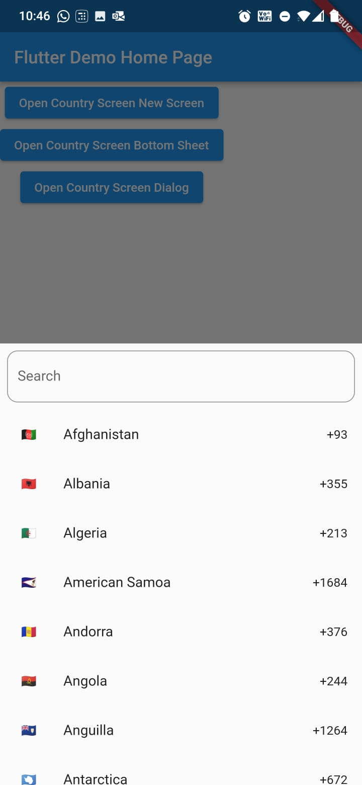
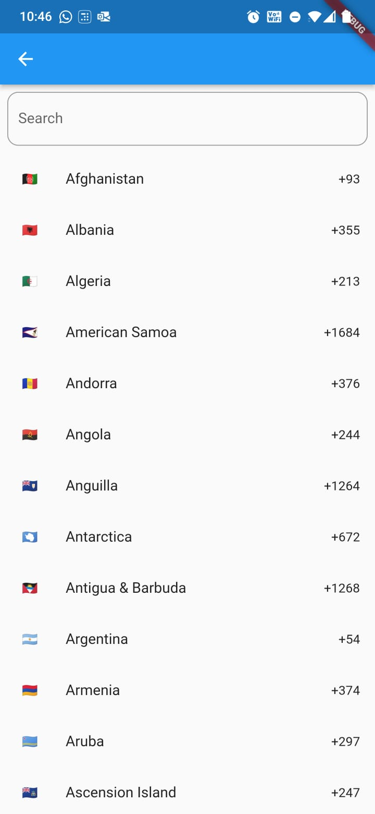
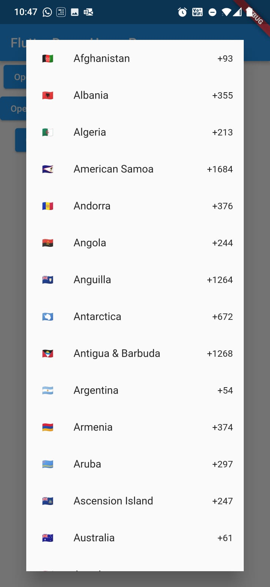

<!-- 
This README describes the package. If you publish this package to pub.dev,
this README's contents appear on the landing page for your package.

For information about how to write a good package README, see the guide for
[writing package pages](https://dart.dev/guides/libraries/writing-package-pages). 

For general information about developing packages, see the Dart guide for
[creating packages](https://dart.dev/guides/libraries/create-library-packages)
and the Flutter guide for
[developing packages and plugins](https://flutter.dev/developing-packages). 
-->

# Beuni_country_picker

A flutter package to select Country code from New Screen, BottomSheet and Dialog box.

## Features

In this package we are showing countries with Country code, Country Name and also showing flags also
in sorted list. Here user can search and filter out country and select country.

[comment]: <> (![ScreenShot]&#40;assets/a1.jpeg&#41;)

[comment]: <> (![ScreenShot]&#40;assets/a2.jpeg&#41;)

[comment]: <> (![ScreenShot]&#40;assets/a3.jpeg&#41;)





## Getting started

Add package to your pubspec.yaml file:

```yaml
beuni_country_picker: 0.0.4
```

## Usage

Usage in BottomSheet:-

```dart
void bottomSheet() {
  showModalBottomSheet(
    context: context,
    enableDrag: true,
    builder: (BuildContext context) {
      return BeuniCountryPicker(
          countryList: [],
          onCountryClick: (Country country) {
            print(country.name);
            Navigator.of(context).pop();
          });
    },
  );
}
```

Usage in Dialog

```dart
void showDialog1() {
  showDialog(
    context: context,
    builder: (BuildContext context) {
      return Dialog(
        shape:
        RoundedRectangleBorder(borderRadius: BorderRadius.circular(20.0)),
        child: BeuniCountryPicker(
            searchText: "Search Here",
            isSearchVisible: false,
            countryList: [],
            onCountryClick: (Country country) {
              print(country.name);
              Navigator.of(context).pop();
            }),
      );
    },
  );
}
```

## Parameters:

* 'countryList':- Need to pass country list if you have your country list otherwise pass []. (
  required)
* 'onCountryClick':- This is called on user Click on country
* 'searchText':- In this need to pass String to set hint in Search field.
* 'isSearchVisible':- Default this is true for showing Search TextField, make it false to hide
  Search TextField

```yaml
BeuniCountryPicker(
searchText: "Search Here",
isSearchVisible: false,
countryList: [ ],
onCountryClick: (Country country) {
  print(country.name);
});
```

If you want add your add your own country list you can also do it:-

```dart
import 'package:beuni_country_picker/src/model/country.dart';
```

Add country value like below, Here one more thing you can add flag emoji or network url for image

```dart

Country country = Country(
    dialCode: "+91",
    flag: "https://flagcdn.com/32x24/in.png",
    code: "IN",
    name: "India"
);
```

Note:- SVG image url is not supported yet

## Contributions

Contributions of any kind are more than welcome! Feel free to fork and improve country_code_picker
in any way you want, make a pull request, or open an issue.
